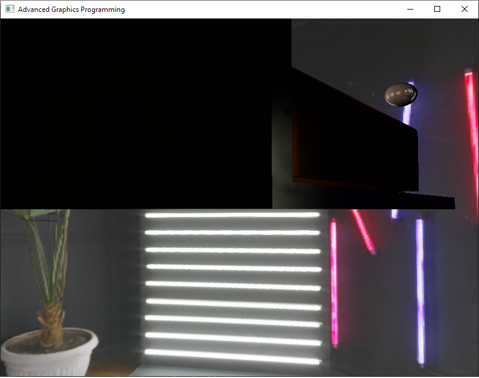

# RenderEngine
Jose L. Redondo Tello

Camera controls: 
The camera will move taking into accont its target, this target can be changed in the camera window.

W, A, S, D
Q move camera up
E move camera down

Basic functionality:
-In the main window we can:
   ·Select the draw mode to see the framebuffer texture
   ·Checkbox to enable/disable debug light draw

-In the model list window we can select a model to load it into the scene

-In the entity list we can pick an entity to see its values and change some of them (pos, rot, scale, albedo, reflectivity).

-In the light section we can modify the different light values
   ·Ambient light strength
   ·Create / delete point and directional lights
   ·Modify light values (position, direction, color, fade distance)

Techniques implemented:
Bloom:
ON

OFF

To configure the effect you can open the bloom window, in which you can activate and disable the effect, and modify the intensity of each bloom layer.

The shaders used are:
-BrightPixelDetection
-BloomBlurrPass
-BloomPass

Environment mapping:
ON

OFF

To configure the reflectiveness of each matererial you can open the material in the entity menu and modify the slider.
To configure the strenth of the environment light you can use the ambient light property of the Light menu.

The shaders used are:
-BloomBlurrPass
-hdrToCubemap
-Skybox
-lightPass